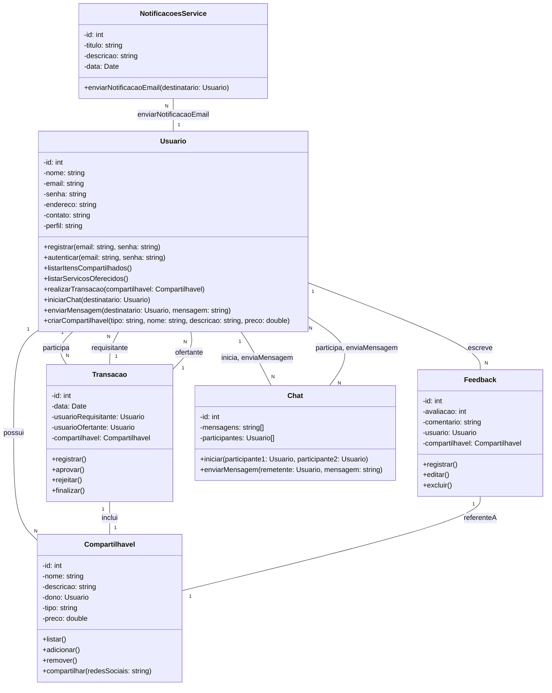

# ComUniShare Backend

This repository represents the backend application of ComUniShare project, built on Java SpringBoot.
(on building)

[Frontend Repository](https://github.com/pedromotta462/ComUniShare/)

## UML Diagram

### Reference Documentation
For further reference, please consider the following sections:

* [Official Apache Maven documentation](https://maven.apache.org/guides/index.html)
* [Spring Boot Maven Plugin Reference Guide](https://docs.spring.io/spring-boot/docs/3.1.5/maven-plugin/reference/html/)
* [Create an OCI image](https://docs.spring.io/spring-boot/docs/3.1.5/maven-plugin/reference/html/#build-image)
* [Spring Data JPA](https://docs.spring.io/spring-boot/docs/3.1.5/reference/htmlsingle/index.html#data.sql.jpa-and-spring-data)
* [Spring Web](https://docs.spring.io/spring-boot/docs/3.1.5/reference/htmlsingle/index.html#web)
* [Flyway Migration](https://docs.spring.io/spring-boot/docs/3.1.5/reference/htmlsingle/index.html#howto.data-initialization.migration-tool.flyway)
* [Spring Security](https://docs.spring.io/spring-boot/docs/3.1.5/reference/htmlsingle/index.html#web.security)
* [Validation](https://docs.spring.io/spring-boot/docs/3.1.5/reference/htmlsingle/index.html#io.validation)
* [Spring Boot DevTools](https://docs.spring.io/spring-boot/docs/3.1.5/reference/htmlsingle/index.html#using.devtools)

