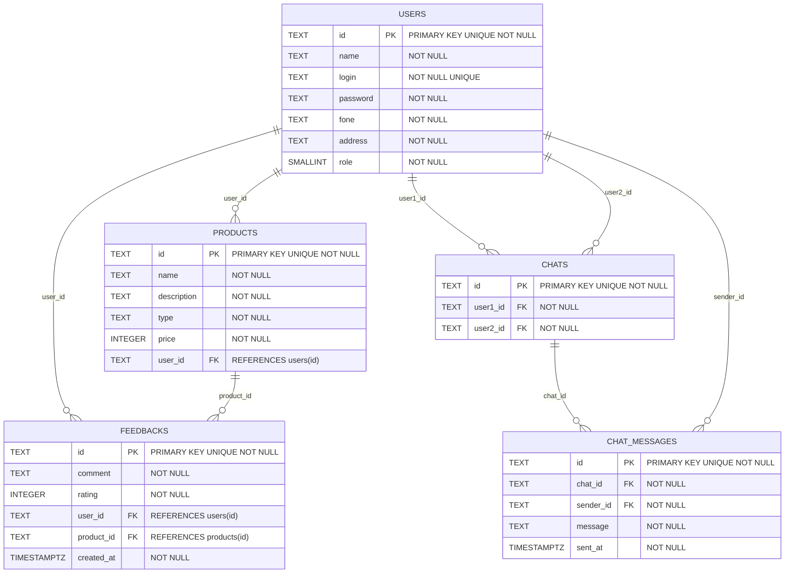

# ComUniShare Backend

This repository represents the backend application of ComUniShare project, built on Java SpringBoot.
(on building)

[Frontend Repository](https://github.com/pedromotta462/ComUniShare/)

[Youtube Presentation](https://www.youtube.com/watch?v=MzVGpceEe6c)

[Slide Presentation](https://www.canva.com/design/DAGHxPUyld8/n-NBz2yD393-Fc9TnD-60w/edit?utm_content=DAGHxPUyld8&utm_campaign=designshare&utm_medium=link2&utm_source=sharebutton)

[API Documentation](https://comunishare.azurewebsites.net/swagger-ui/index.html)
PS: when in swagger-ui, just search for /v3/api-docs on search bar, then will appear the informations.

[API Documentation Json](https://comunishare.azurewebsites.net/v3/api-docs)
If you prefer, its possible find the documentation in json file on this link, which you can use to import for another software to test, like postman or insomnia

## UML Diagram

### Reference Documentation
For further reference, please consider the following sections:

* [Official Apache Maven documentation](https://maven.apache.org/guides/index.html)
* [Spring Boot Maven Plugin Reference Guide](https://docs.spring.io/spring-boot/docs/3.1.5/maven-plugin/reference/html/)
* [Create an OCI image](https://docs.spring.io/spring-boot/docs/3.1.5/maven-plugin/reference/html/#build-image)
* [Spring Data JPA](https://docs.spring.io/spring-boot/docs/3.1.5/reference/htmlsingle/index.html#data.sql.jpa-and-spring-data)
* [Spring Web](https://docs.spring.io/spring-boot/docs/3.1.5/reference/htmlsingle/index.html#web)
* [Flyway Migration](https://docs.spring.io/spring-boot/docs/3.1.5/reference/htmlsingle/index.html#howto.data-initialization.migration-tool.flyway)
* [Spring Security](https://docs.spring.io/spring-boot/docs/3.1.5/reference/htmlsingle/index.html#web.security)
* [Validation](https://docs.spring.io/spring-boot/docs/3.1.5/reference/htmlsingle/index.html#io.validation)
* [Spring Boot DevTools](https://docs.spring.io/spring-boot/docs/3.1.5/reference/htmlsingle/index.html#using.devtools)

